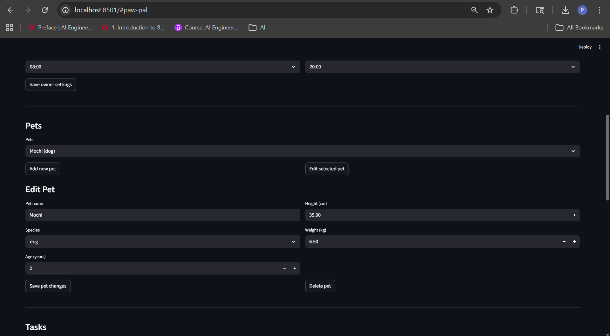
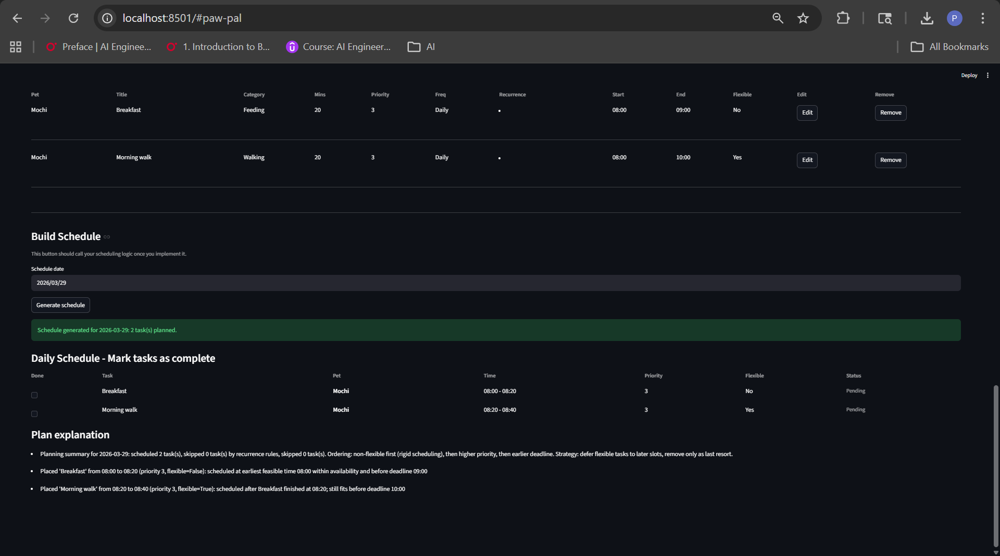

# PawPal+

PawPal+ is a Streamlit-based pet care planning app that helps owners organize daily care tasks across one or more pets.

The app combines task management, scheduling rules, recurrence support, and plan explainability to create practical day-by-day care plans.

## Demo

PawPal+ provides an intuitive Streamlit interface for managing pet care across multiple pets with intelligent scheduling:

**1. Owner Setup & Pet Management**  


Set owner preferences, configure weekly availability windows, and add/manage multiple pets with detailed profiles.


**2. Pet Setup** 


Add, edit, and remove pets with profile details (name, species, age, height, and weight).


**3. Task Creation & Management** 


Create tasks with recurrence patterns (daily, weekly, custom), time windows, priorities, and flexibility. View, filter, and edit tasks in a structured table.


**4. Intelligent Daily Scheduling & Explanations** 


Generate daily schedules, track completion, detect conflicts, and review plan explanations for why tasks were placed, deferred, or skipped.

## Features

### Product capabilities

1. **Owner + pet profile management**
   - Create and edit owner profile settings (timezone, preferences, notification lead).
   - Add, edit, and remove pets with species and basic physical details.

2. **Task lifecycle management (CRUD)**
   - Add, edit, and remove care tasks per pet.
   - Capture category, duration, priority, flexibility, time bounds, and notes.

3. **Recurrence-aware planning**
   - Support task frequencies: `DAILY`, `WEEKLY`, and `CUSTOM`.
   - Weekly recurrence uses a target weekday.
   - Custom recurrence supports selected weekdays or every-N-days interval with an anchor date.

4. **Daily schedule generation + explanations**
   - Generate a day plan from all pets/tasks for the selected date.
   - Return schedule explanations describing why tasks were placed, deferred, or skipped.

5. **Interactive schedule execution tracking**
   - Mark scheduled items complete/incomplete from the UI.
   - Completion timestamps are recorded and completion state is preserved across same-day schedule regeneration.

6. **Task visibility and conflict awareness**
   - Filter task views by pet and flexibility.
   - Sort task lists and scheduled items chronologically for stable display.
   - Detect overlapping schedule items and show conflict warnings/suggested fixes.

### Scheduling algorithms implemented

1. **Window-aware greedy placement**
   - Tasks are placed in the earliest feasible non-overlapping slot inside owner availability windows.

2. **Priority + rigidity ordering**
   - Candidate tasks are ordered with non-flexible tasks first, then higher priority, then tighter time bounds.

3. **Backtracking with deferral/removal strategy**
   - If no slot is found, the scheduler first defers lower-priority flexible tasks.
   - If still blocked, it removes lower-priority rigid tasks as a last resort.

4. **Flexible overflow handling**
   - Flexible tasks may be scheduled after their preferred deadline when no pre-deadline gap exists (but still within availability).

5. **Constraint filtering layer**
   - Hard constraints are validated against candidate tasks before placement.
   - Owner preference `avoid_late_night` is enforced during filtering.

6. **Post-processing and observability**
   - `DailySchedule.regenerate()` validates items, removes invalid entries, and adjusts non-locked overlaps.
   - Planning summary and per-task reason codes improve explainability/debuggability.

## Getting started

### Setup

```bash
python -m venv .venv
source .venv/bin/activate  # Windows: .venv\Scripts\activate
pip install -r requirements.txt
```

### Testing PawPal+

**Run tests with:**

```bash
python -m pytest
```

**Current test coverage includes:**

1. **Task CRUD and completion flow**
	- Verifies task creation and completion state persistence.
	- Validates completion-related error handling paths.

2. **Core scheduling behavior and ordering**
	- Ensures tasks are scheduled within expected time bounds.
	- Confirms deterministic chronological ordering.

3. **Priority, backtracking, deferral, and flexibility behavior**
	- Validates contention handling under limited schedule capacity.
	- Confirms high-priority rigid task preference and flexible-task deferral.

4. **Recurrence rules**
	- Verifies daily, weekly, and custom recurrence behavior.
	- Covers interval-based and weekday-based custom rules.

5. **Availability and constraint filtering**
	- Ensures owner availability and preferences are enforced.
	- Validates hard constraint filtering before final placement.

6. **Schedule regeneration and conflict handling**
	- Confirms overlap adjustment and invalid-item cleanup.
	- Checks lock-aware behavior during regeneration.

7. **Explanations and observability**
	- Verifies planning outputs include meaningful explanations and reason codes.
	- Confirms explainability behavior for non-trivial planning outcomes.
