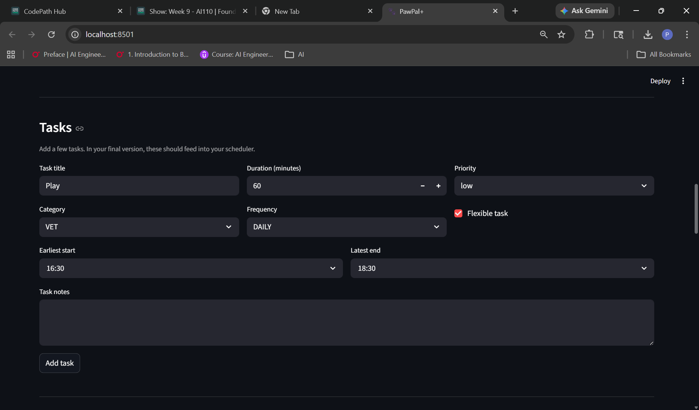
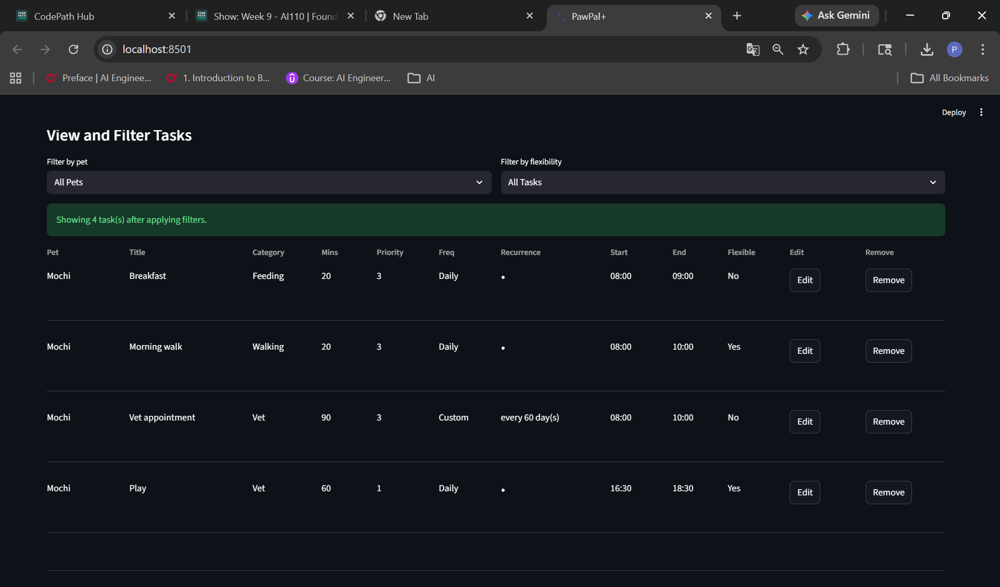
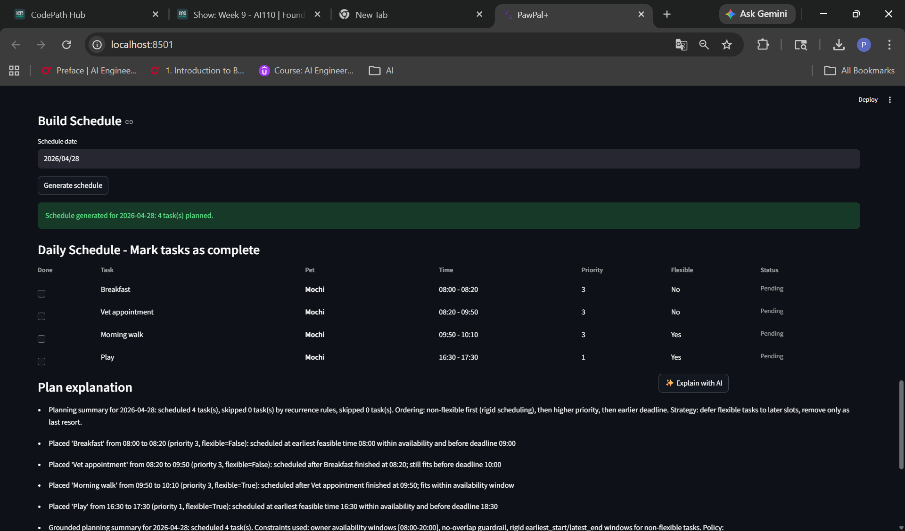
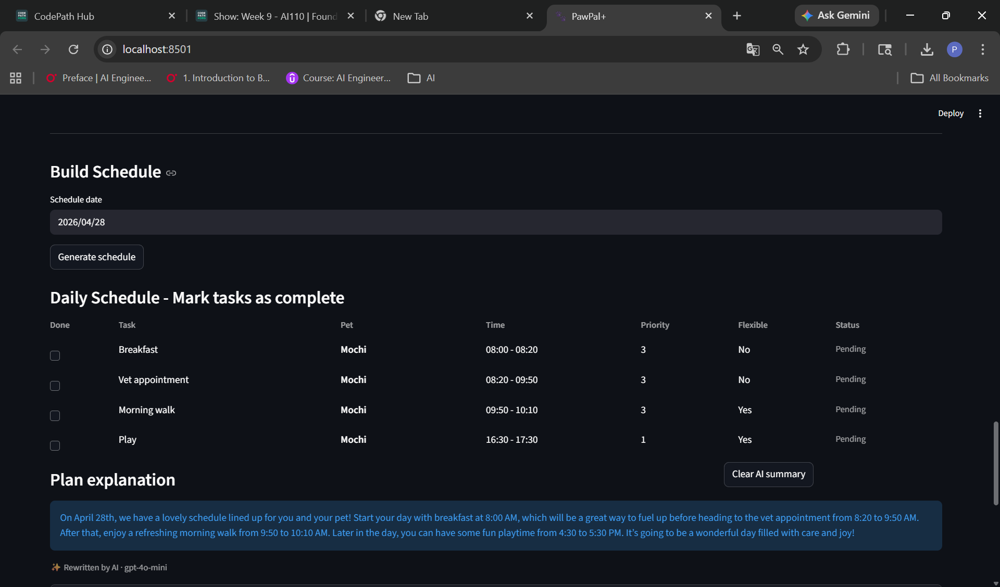
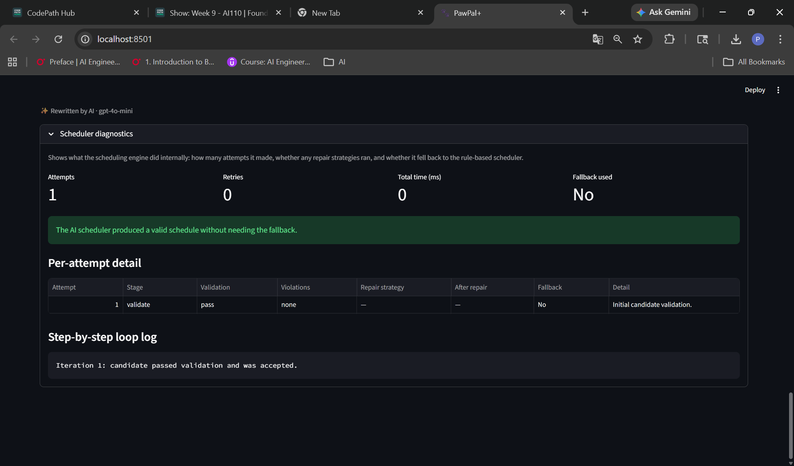
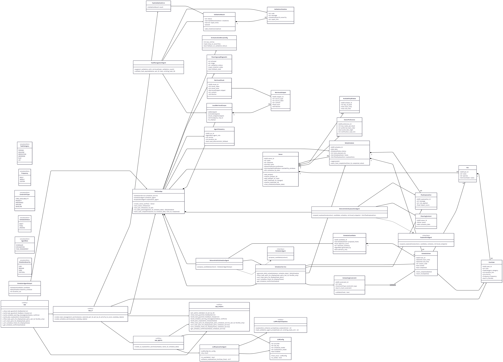

# PawPal+

> An intelligent pet care planning application that combines deterministic scheduling, multi-agent orchestration, and LLM-powered explanations to help pet owners never miss a feeding, walk, or vet visit.

---

## Original Project (Modules 1–3)

The original project — **PawPal** — was a straightforward pet care planner built around three core classes: `Owner`, `Pet`, and `Scheduler`. Its goals were simple: allow an owner to add or remove pets, manage care tasks per pet, and view a generated daily schedule at any point during the day. The scheduling logic was greedy and linear — tasks were placed in order of arrival without priority modeling, backtracking, or recurrence support. There was no validation layer, no conflict detection, and no explainability beyond a basic task list.

---

## Title and Summary

**PawPal+** extends the original concept into a production-ready scheduling system with intelligent multi-agent orchestration. It solves a real problem: pet care is repetitive, time-sensitive, and easy to forget — especially across multiple pets with competing schedules. PawPal+ generates daily care plans that respect owner availability, task priorities, and recurrence patterns, then explains *why* each task was placed or deferred in plain language. It matters because it removes the cognitive overhead of coordinating pet care, while the explainability layer builds trust in the automated schedule.

## Walkthrough Video

[PawPal+ Walkthrough Video](https://www.loom.com/share/cb63a893d9db4819a6af1292aa22272b)


---

**Live demo screenshots:**

**1. Owner Setup & Pet Management**
*Register an owner with availability windows that constrain when tasks can be scheduled.*


**2. Pet Profiles**
*Add pets with species and age — used to personalise task suggestions and explanations.*


**3. Task Creation & Management**
*Create care tasks with priority, duration, time windows, and recurrence rules.*

*View, edit, and remove tasks across all pets from a single management panel.*


**4. Intelligent Daily Scheduling & Explanations**
*The scheduler places tasks greedily by priority, respects rigid windows, and pushes flexible tasks to the next available slot rather than dropping them.*

*Plain-language explanation of each scheduling decision, enhanced by gpt-4o-mini when an API key is provided.*

*Diagnostics panel showing repair steps taken, conflicts detected, and tasks deferred.*


---

## Architecture Overview

PawPal+ is organized into five layers that compose to form the full system:

```
┌─────────────────────────────────────────────────────────┐
│                    Streamlit UI Layer                    │
│   app.py  ·  app_ui.py  ·  app_helpers.py               │
└────────────────────────┬────────────────────────────────┘
                         │
┌────────────────────────▼────────────────────────────────┐
│               Multi-Agent Orchestration                  │
│   PetCareApp  ·  DeterministicSchedulerAgent             │
│   TaskManagementAgent  ·  DeterministicExplanationAgent  │
└────────────────────────┬────────────────────────────────┘
                         │
┌────────────────────────▼────────────────────────────────┐
│             Deterministic Scheduling Engine              │
│   SchedulerService  ·  window-aware greedy placement     │
│   priority ordering  ·  backtracking + deferral          │
└────────────────────────┬────────────────────────────────┘
                         │
┌────────────────────────▼────────────────────────────────┐
│              Retrieval & Grounding Layer                 │
│   LocalRetrievalCorpus  ·  BM25-style scoring            │
│   source attribution  ·  snippet-based context           │
└────────────────────────┬────────────────────────────────┘
                         │
┌────────────────────────▼────────────────────────────────┐
│                  LLM Enhancement Layer                   │
│   LLMExplanationAgent  ·  OpenAI API (gpt-4o-mini)       │
│   graceful degradation  ·  deterministic fallback        │
└─────────────────────────────────────────────────────────┘
```



**Key architectural principle:** The deterministic scheduler is always the source of truth. Agent outputs are advisory only and must pass validation before affecting the final schedule. If the LLM is unavailable or produces invalid output, the system falls back to the deterministic schedule automatically — the app never breaks.

**File responsibilities at a glance:**

| File | Role |
|---|---|
| `pawpal_system.py` | Core domain models, scheduling engine, agent orchestration, validation, retrieval |
| `app.py` | Streamlit entry point, session state management, page layout |
| `app_ui.py` | UI rendering: task management, schedule display, conflict detection |
| `app_helpers.py` | Formatting, filtering, sorting, and guardrail feedback helpers |
| `app_agents.py` | LLM explanation enhancement integration point |
| `llm_agents.py` | OpenAI API wrapper with error handling and graceful degradation |
| `llm_config.py` | LLM provider config, prompt templates, environment variable management |

---

## Setup Instructions

**Prerequisites:** Python 3.10+, an OpenAI API key (optional — the app works fully without it)

```bash
# 1. Clone the repository
git clone <your-repo-url>
cd paw_plan_AI

# 2. Create and activate a virtual environment
python -m venv .venv

# Windows
.venv\Scripts\activate

# macOS / Linux
source .venv/bin/activate

# 3. Install dependencies
pip install -r requirements.txt

# 4. (Optional) Set your OpenAI API key for AI-enhanced explanations
#    Without this, the app runs fully on deterministic explanations
export OPENAI_API_KEY=your_key_here       # macOS / Linux
set OPENAI_API_KEY=your_key_here          # Windows CMD
$env:OPENAI_API_KEY="your_key_here"       # Windows PowerShell

# 5. Run the app
streamlit run app.py
```

Open [http://localhost:8501](http://localhost:8501) in your browser.

**Run tests:**
```bash
python -m pytest
```

---

## Sample Interactions

### Example 1: Flexible Task Gets Deferred — Morning Walk

**Setup:**
- Owner "Jordan" is available Monday–Friday, 8:00 AM – 8:00 PM
- Pet: Mochi (dog, 2 years)
- Tasks for Monday:
  - Breakfast feeding — 20 min, high priority, non-flexible, window 8:00–10:00 AM
  - Vet appointment — 90 min, high priority, non-flexible, window 2:00–4:00 PM
  - Morning walk — 30 min, medium priority, flexible, preferred window 8:00–10:00 AM

**Generated schedule:**

| Time | Task | Status |
|---|---|---|
| 8:00 – 8:20 AM | Breakfast feeding | Scheduled (rigid) |
| 8:20 – 8:50 AM | Morning walk | Deferred (pushed past preferred window) |
| 2:00 – 3:30 PM | Vet appointment | Scheduled (rigid) |

**Explanation output:**
> "Breakfast feeding was placed at 8:00 AM as the first available slot. The morning walk was requested for 8:00–10:00 AM, but after placing feeding only 10 minutes remained before 8:20 AM. Since the morning walk is flexible, it was shifted to 8:20 AM — still within your availability window. The vet appointment was locked into its 2:00 PM window as a non-flexible task."

---

### Example 2: Conflict Detection — Two High-Priority Overlapping Tasks

**Setup:**
- Owner "Alex", available 9:00 AM – 6:00 PM
- Pet: Biscuit (cat, 5 years)
- Tasks:
  - Medication — 15 min, high priority, non-flexible, window 9:00–9:30 AM
  - Grooming session — 60 min, medium priority, flexible, window 9:00–11:00 AM

**Generated schedule:**

| Time | Task | Notes |
|---|---|---|
| 9:00 – 9:15 AM | Medication | Placed first (higher priority, non-flexible) |
| 9:15 – 10:15 AM | Grooming session | Shifted 15 minutes — no conflict |

**Conflict detection output (if user manually overrides times):**
> "Warning: Grooming session (9:00–10:00 AM) overlaps with Medication (9:00–9:15 AM) by 15 minutes. Suggested fix: move Grooming session to 9:15 AM since it is flexible."

---

### Example 3: AI-Enhanced Explanation (with OpenAI enabled)

**Raw deterministic explanation:**
```
PLACED at 08:00 | reason=EARLIEST_SLOT | priority=HIGH | rigid=True
DEFERRED at 08:20 | reason=NO_SLOT_IN_WINDOW | flexible=True | overflow=True
PLACED at 14:00 | reason=WINDOW_CONSTRAINED | priority=HIGH | rigid=True
```

**AI-enhanced explanation (gpt-4o-mini):**
> "Your day starts with Mochi's breakfast at 8 AM — right on schedule. The morning walk got bumped to 8:20 AM because feeding needed that first slot, but since walks are flexible I found the next open gap so nothing was skipped. The vet appointment is locked in at 2 PM as planned. You're all set for a smooth Monday!"

---

## Design Decisions

### 1. Deterministic scheduler as the source of truth
LLM outputs are advisory only. The `SchedulerService` always produces a valid schedule that the validation layer signs off on before anything is shown to the user. This prevents the UI from ever breaking due to an LLM timeout, hallucination, or rate-limit error.

*Trade-off:* The explanations from the deterministic engine are more mechanical ("PLACED at 08:00 | reason=EARLIEST_SLOT") until the optional LLM enhancement runs. This was intentional — correctness over polish.

### 2. Three-tier repair ladder instead of hard failure
When the scheduler produces a candidate with violations, it doesn't immediately fail. It climbs a repair ladder:
1. **Lightweight repair** — regenerate with the same inputs
2. **Targeted repair** — move flexible tasks to open slots
3. **Structural repair** — recompute from scratch

This means the user almost never sees an empty schedule — the system resolves conflicts internally.

*Trade-off:* The repair logic adds complexity. A simpler "fail and show error" approach would be easier to debug, but would surface internal scheduling tension directly to the user rather than resolving it automatically.

### 3. Retrieval layer for explanation grounding
A local BM25-style retrieval corpus is built from owner preferences, recent schedule outcomes, and policy snippets. The `DeterministicExplanationAgent` queries this corpus to ground its claims before they're presented to the user. Non-trivial claims without retrieval support are rejected.

*Trade-off:* This makes explanations more trustworthy but adds latency on first schedule generation. A simpler system would skip grounding and just narrate what the scheduler did.

### 4. Flexible overflow instead of task dropping
Flexible tasks that can't fit in their preferred time window are pushed to the next available slot within owner availability — they are never silently dropped.

*Trade-off:* A task might be scheduled later than the owner wanted, which could feel like it defeated the purpose of the time window. The alternative (dropping the task) seemed worse — the owner would lose visibility entirely.

### 5. In-memory state (no database)
All owner, pet, task, and schedule data lives in Streamlit session state. This was a deliberate scope decision to stay focused on the scheduling and AI features during development.

*Trade-off:* Data is lost on page refresh. A real product would need database integration — this is the top-priority next step.

---

## Testing Summary

**What worked well:**

- **Core scheduling logic** was the most thoroughly tested area. Priority ordering, backtracking, deferral, and flexible overflow all behave as expected across a wide range of task combinations.
- **Recurrence rules** (daily, weekly, custom interval, custom weekday-based) were validated end-to-end and edge cases like anchor-date arithmetic were caught early through automated tests.
- **Validation guardrails** for task creation (zero-duration tasks, invalid time windows, contradictory recurrence rules) surface clear error messages with repair hints that guided me to fix real bugs in the input forms.
- **Schedule regeneration** preserves completion state correctly — a task marked complete at 9 AM stays complete after re-generating the schedule at noon.

**What was harder to verify:**

- **LLM explanation quality** is subjective. The automated tests verify that the agent calls the API and returns a string, but cannot assert that the explanation is actually helpful or accurate. Manual review was required.
- **Retrieval grounding** was difficult to test comprehensively because the corpus is built dynamically from session state. Unit tests covered the BM25 scoring logic but end-to-end retrieval quality required manual inspection.
- **Edge cases in backtracking** with three or more competing rigid tasks needed careful manual scenario construction — the automated test suite covers the most important permutations but not all possible orderings.

**Key lessons:**

- Writing test cases *before* implementing the repair ladder forced me to define what "valid" meant precisely, which caught two logic errors in the overlap-detection code before they reached the UI.
- The AI (Claude Code and Github copilot) were useful for generating test scaffolding quickly, but every generated test had to be reviewed — some tested the wrong behavior or made assumptions about internal state that didn't match the actual implementation.
- Testing UI behavior (Streamlit session state interactions) required manual testing because unit tests can't fully simulate user interaction flows.

---

## Reflection

Building PawPal+ taught me that **the hardest part of building AI-assisted systems is deciding when not to use the AI.** The first instinct is to route everything through an LLM — scheduling, validation, explanations, conflict resolution. But each LLM call introduces latency, cost, and potential failure. The turning point in this project was committing to the principle that the deterministic scheduler is always right, and the LLM is always advisory. That single decision made the entire system more reliable and easier to reason about.

On the AI collaboration side, I learned that **clear, scoped prompts produce better results than open-ended ones.** Early in the project, asking "what should I add to this app?" produced suggestions that would have tripled the scope. Asking "given this specific scheduling constraint, what's the simplest data structure to represent it?" produced something I could actually use. The AI is most valuable when I already know what I'm trying to accomplish and need help with *how* — not when I'm asking it to define the *what* for me.

The UML design phase also turned out to matter more than I expected. The initial three-class model (Owner, Pet, Scheduler) was too coarse — it caused the Scheduler class to accumulate responsibilities that belonged elsewhere. Breaking out `OwnerPreference`, `AvailabilityWindow`, `CareTask`, `ScheduleItem`, `DailySchedule`, and `PlanExplanation` as separate entities made the codebase dramatically easier to extend. The lesson: investing time in design pays off in proportion to how long you spend on the implementation that follows it.

Finally, building explainability in from the start — not as a post-hoc feature — shaped the entire architecture. Having the scheduler emit reason codes (`PLACED`, `DEFERRED`, `NO_SLOT_IN_WINDOW`) for every decision made debugging faster, made the retrieval grounding layer possible, and made the LLM enhancement layer straightforward to wire in. Systems that explain themselves are easier to trust, easier to test, and easier to hand off.

---

## Tech Stack

| Layer | Technology |
|---|---|
| UI | Streamlit |
| Language | Python 3.10+ |
| LLM API | OpenAI (gpt-4o-mini) |
| Retrieval | Custom BM25-style local corpus |
| Testing | pytest |
| State management | Streamlit session state |

---

